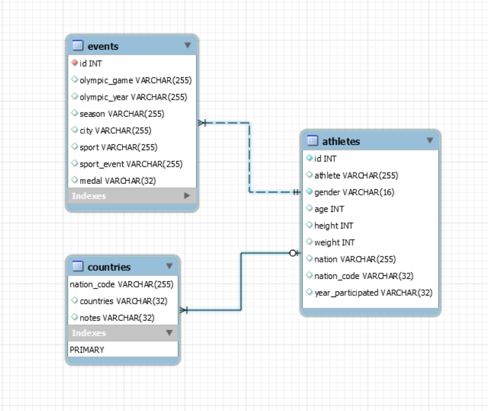
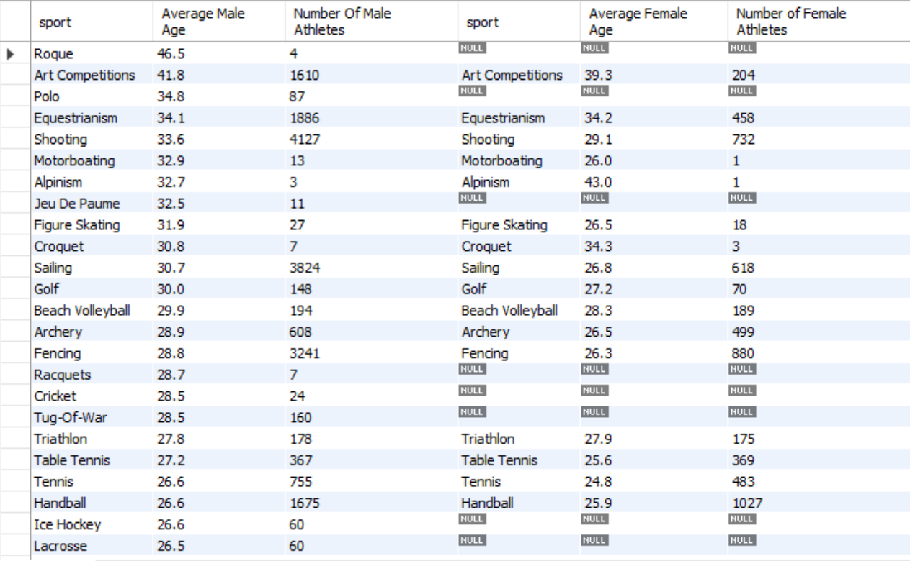

# Data Engineering 1 Term Project

## Operational Layer

The Olympians dataset contains 9 variables:

* ID: A number used as a unique identifier for each athlete
* Name: The athlete’s name(s) in the form of First Middle Last where available
* Sex: The athlete’s gender; one of M or F
* Age: The athlete’s age in years
* Height: The athlete’s height in centimeters (cm)
* Weight: The athlete’s weight in kilograms (kg)
* Team: The name of the team that the athlete competed for
* NOC: The National Organizing Committee’s 3-letter code
* Year: The year of the Olympics that the athlete competed in

The events_final dataset contains 8 variables:

* ID: A number used as a unique identifier for each athlete
* Games: The year and season of the Olympics the athlete competed in in the format YYYY Season
* Year: The year of the Olympics that the athlete competed in
* Season: The season of the Olympics that the athlete competed in
* City: The city that hosted the Olympics that the athlete competed in
* Sport: The sport that the athlete competed in
* Event: The event that the athlete competed in
* Medal: The medal won by the athlete; one of Gold, Silver, or Bronze. NA if no medal was won.

The Country dataset contains 3 variables:

* NOC: The National Organizing Committee’s 3-letter code
* region: The name of the country/region associated with the NOC code
* notes: Any extra/miscellaneous information about the NOC region

The tables were joined through first ID (olympians and events_final) and NOC (olympians and country). As a result of the join it could be noted that some alreay-collapsed nations like Soviet Union disappeared as a Nation. Due to the join on country codes, as several countries had more country codes under them, several countries gained the data. For example the Soviet Union data belongs now under Russia.

## Analytical Layer
After loading the athletes, events and countries tables to MYSQL Workbench several stored procedures were created to create our final analytical data layer olympics_final. These stroed procedures are the following: 

1. CreateOlympicsDataset() creates table olympics that has several issues that need to be atended.

After calling CreateOlympicDataset() I looked for duplicates, and a significant number of duplicates were spotted. In order to exclude these duplicates a new table, olympics_final was created with a simple query. However further data cleaning was necessary to achieve a useful analytical layer.

2. CleaningData1() replaces 'M' and 'F' to 'Male' and 'Female' respectively. 

3. CleaningData2() replaces all null values for age, height and weight with the average values of age, height and weight by both Male and Female.  

### Analytical Questions

The Olympics raises plenty of questions and interesting ideas, therefore, I tried to look into several different aspects of Olympics.

#### Question 1: What is the ranking of countries based on total medal counts? Also would like to visualize the number of distinct athletes that won the medals and the number of total participants.

#### Question 2: How many total medals did the athletes win by sports in a given year? This given year is 1992.

#### Question 3: How many medals were won in the sport "Swimming" by Olympic years?

#### Question 4: When were the first olympic gold medals awarded to Hungary in every sport?

#### Question 5: List of gold winner Hungarian female athletes.

#### Question 6: What was the average age of female and male athletes per sport?

#### Question 7: What was the top 10 youngest average age sports?

#### Question 8: How many Gold/Silver/Bronze medals were won by a contry in a given year?

#### Question 9: Who were the top 15 gold medal winner countries in 2016?

#### Question 10: Who were the top 15 atheltes in total number of medals won? Most succesful athletes?

### Data Marts
The following solutions were given for the questions asked. For some questions I found a stored procedure to be more informative as the parameters could be changed in light of the wish of the viewer.

### Solutions
#### Question 1: CALL MedalRanking();

Success rate was defined by me as "very successful" country with total medals > 300, "successful" countries between 20 and 300 total medals, and "needs more work" countries with total medals < 20.

#### Question 2: CALL GetMedalsPerSportEvent('1992');

1992 was chosen as this was the only year which had both a Summer and Winter Olympics Game.

#### Question 3: CALL GetTotalMedalsForSportEventEachYear('Swimming');

I used stored procedure, in order to easily change the sport, if somebody is interested in different sports.

#### Question 4: SELECT * FROM First_Olympic_Golds_Sport;

#### Question 5: SELECT * FROM Hungary_women_gold_medals;

#### Question 6: CALL AverageAgeForSports();

#### Question 7: SELECT * FROM Average_age_and_NumberOfParticipants;

#### Question 8: CALL GetMedalCountByCountry('Hungary', '2016', @total); select @total;

I answered this question using a stored procedure, in which the country and year can be changed to any wanted value.

#### Question 9: SELECT * FROM Total_Gold_Medals_In_2016;

Created a view of the top 15 gold medal winner countries in 2016.

#### Question 10: SELECT * FROM most_successful_athletes;

Created a view of the top 15 athltes in total number of medals won.

© 2020 GitHub, Inc.

